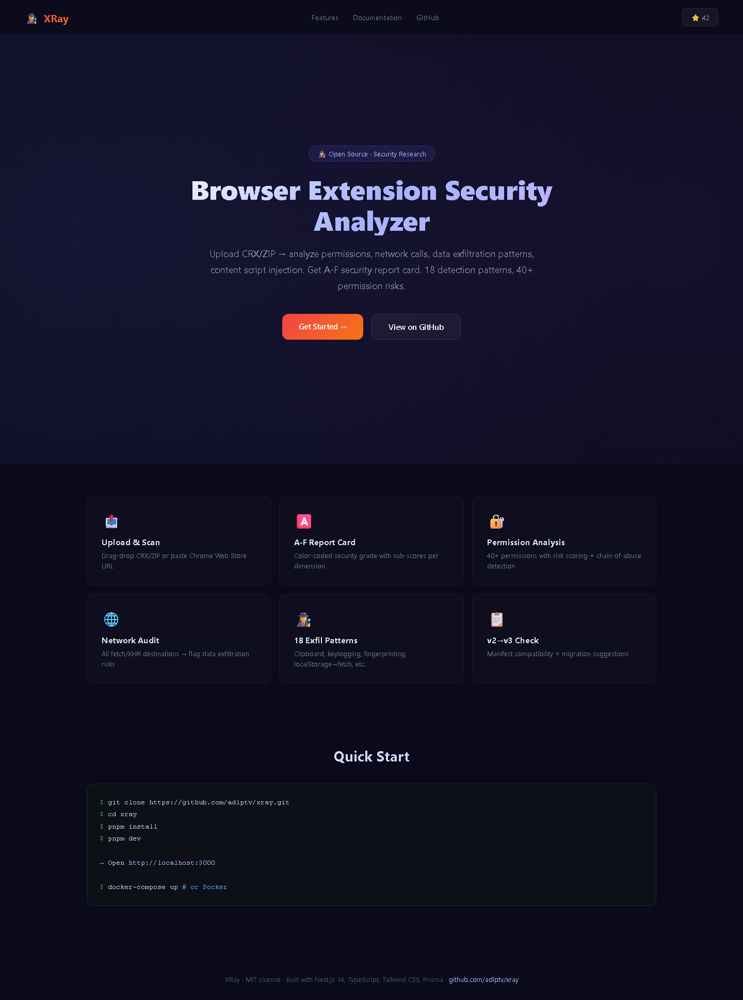
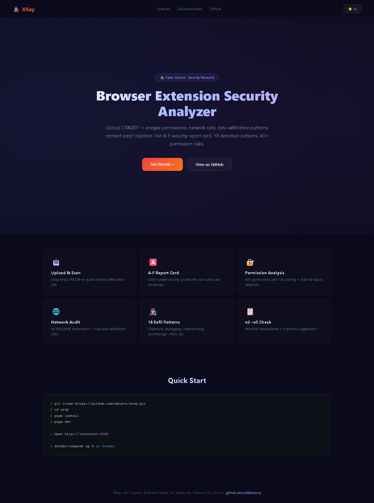

# XRay — Browser Extension Security Analyzer

> Upload, analyze, and secure browser extensions. Deep static analysis with A–F grading, permission risk scoring, network call auditing, content script visualization, and data exfiltration detection.


## 📋 Table of Contents

- [Overview](#overview)
- [Features](#features)
- [Tech Stack](#tech-stack)
- [Getting Started](#getting-started)
- [Project Structure](#project-structure)
- [API Reference](#api-reference)
- [Analysis Modules](#analysis-modules)
- [Docker](#docker)
- [Testing](#testing)
- [Contributing](#contributing)

## Overview

XRay is a static analysis tool for browser extensions (Chrome/Firefox). Upload a `.crx` or `.zip` file — or paste a Chrome Web Store URL — and get an instant security report card. All analysis runs locally; no file data ever leaves your machine.

## Features

### 🔍 Deep Static Analysis
Parses and inspects every file in the extension package — JavaScript, HTML, CSS, JSON. AST-level pattern matching for suspicious code.

### 📊 A–F Security Grading
Weighted scoring across five dimensions produces an overall letter grade (A = excellent, F = critical):

| Dimension | Weight | Description |
|-----------|--------|-------------|
| Permissions | 30% | Risk scoring per Chrome/Firefox permission |
| Network | 25% | Outbound requests, suspicious domains |
| Content Scripts | 15% | URL match pattern breadth |
| Exfiltration | 20% | Clipboard, cookie, keylogging, fingerprinting |
| Manifest | 10% | V2/V3 compatibility, deprecated APIs |

### 🔐 Permission Risk Scoring
Database of 40+ Chrome/Firefox permissions with:
- Base risk score (0–100)
- Risk level (low / medium / high / critical)
- Contextual warnings
- Diminishing-returns multiplier for many permissions

### 🌐 Network Call Audit
Extracts and categorizes all outbound network requests:
- URL extraction from string literals
- fetch(), XMLHttpRequest, axios, jQuery patterns
- WebSocket connections
- sendBeacon detection
- Suspicious domain flagging (pastebin, ngrok, webhook.site, etc.)
- Tracking domain identification (Google Analytics, Facebook, etc.)

### 👁️ Content Script Visualization
Shows exactly which URLs your extension injects into:
- Match pattern risk scoring (`<all_urls>` = critical)
- Financial site flagging (bank, paypal, stripe)
- Auth page flagging (Google login, account pages)
- Wildcard pattern detection

### 🚨 Data Exfiltration Detection
18 heuristic patterns including:
- Clipboard access (read/write)
- Cookie stealing
- Keylogging (keyboard event listeners)
- Form field capture
- Screenshot capability
- Device fingerprinting (canvas, WebRTC, navigator properties)
- Dynamic code execution (eval, Function constructor)
- Beacon API (background data transmission)

### 📋 Manifest V2/V3 Compatibility
- V2-only key detection (browser_action, background.scripts)
- Deprecated API usage (webRequestBlocking, tabs.executeScript)
- CSP format validation (string vs object in V3)
- web_accessible_resources format check
- Migration blocker identification

### ⚖️ Extension Comparison
Side-by-side comparison of two scan results:
- Grade difference
- Permission set diff (common, only-in-A, only-in-B)
- Network call counts and domains
- File size comparison

##
## 📸 Screenshots

| Landing Page | Dashboard |
|:---:|:---:|
|  |  |

> 💡 *Run locally to see the full interactive experience: `pnpm dev` then open http://localhost:3000*

 Tech Stack

| Layer | Technology |
|-------|-----------|
| Framework | Next.js 14 (App Router) |
| Language | TypeScript 5.4 |
| Database | SQLite (Prisma ORM) |
| Styling | Tailwind CSS + Framer Motion |
| UI | Radix UI primitives, Lucide icons |
| Validation | Zod |
| Testing | Vitest (unit), Playwright (E2E) |
| Container | Docker + docker-compose |

## Getting Started

### Prerequisites

- Node.js 20+
- npm or yarn

### Installation

```bash
# Clone the repository
git clone https://github.com/yourusername/xray.git
cd xray

# Install dependencies
npm install

# Set up the database
cp .env.example .env.local
npx prisma db push

# Run development server
npm run dev
```

Visit `http://localhost:3000`.

### Usage

1. **Upload an extension**: Drag & drop a `.crx` or `.zip` file, or paste a Chrome Web Store URL
2. **Review the report card**: Overall grade with sub-grades for each analysis module
3. **Drill into details**: Tabbed view for permissions, network, content scripts, exfiltration, manifest, vulnerabilities
4. **Compare extensions**: Side-by-side diff of two scans
5. **View history**: All past scans with grades, dates, and quick access

## Project Structure

```
xray/
├── src/
│   ├── app/                      # Next.js App Router
│   │   ├── layout.tsx            # Root layout
│   │   ├── page.tsx              # Landing page
│   │   ├── upload/page.tsx       # Upload page
│   │   ├── analysis/[id]/page.tsx # Analysis dashboard
│   │   ├── history/page.tsx      # Scan history
│   │   ├── settings/page.tsx     # Settings
│   │   ├── compare/[id1]/[id2]/  # Comparison view
│   │   └── api/                  # API routes
│   │       ├── analyze/route.ts
│   │       ├── analyses/route.ts
│   │       ├── analyses/[id]/route.ts
│   │       ├── analyses/[id]/compare/[id2]/route.ts
│   │       ├── permissions/route.ts
│   │       └── health/route.ts
│   ├── components/               # React components
│   │   ├── navbar.tsx
│   │   ├── footer.tsx
│   │   ├── hero.tsx
│   │   ├── file-upload.tsx
│   │   ├── report-card.tsx
│   │   ├── permission-list.tsx
│   │   ├── network-table.tsx
│   │   ├── exfil-detector.tsx
│   │   ├── content-script-viz.tsx
│   │   ├── manifest-check.tsx
│   │   ├── vulnerability-list.tsx
│   │   ├── comparison-view.tsx
│   │   ├── grade-badge.tsx
│   │   ├── theme-provider.tsx
│   │   ├── theme-toggle.tsx
│   │   ├── stat-card.tsx
│   │   ├── empty-state.tsx
│   │   └── loading-spinner.tsx
│   └── lib/                      # Core analysis engine
│       ├── analyzer.ts           # Main orchestration
│       ├── grade.ts              # Grade calculation
│       ├── permissions.ts        # Permission database
│       ├── network-analyzer.ts   # Network call extraction
│       ├── exfil-detector.ts     # Exfiltration heuristics
│       ├── manifest-checker.ts   # V2/V3 compatibility
│       ├── validators.ts         # Zod schemas
│       ├── constants.ts          # Shared constants
│       ├── prisma.ts             # Prisma client
│       └── utils.ts              # Utility functions
├── prisma/schema.prisma          # Database schema
├── tests/                        # Vitest unit tests
├── Dockerfile                    # Container image
├── docker-compose.yml            # Orchestration
└── package.json
```

## API Reference

### `POST /api/analyze`
Upload and analyze an extension. Accepts `multipart/form-data` (file upload) or `application/json` (Chrome Web Store URL).

**File upload:**
```
POST /api/analyze
Content-Type: multipart/form-data
Body: file=<crx-or-zip-file>
```

**URL mode:**
```
POST /api/analyze
Content-Type: application/json
Body: { "url": "https://chromewebstore.google.com/detail/..." }
```

**Response:** `{ "id": "<scan-id>", "grade": "<A-F>" }`

### `GET /api/analyses`
List all scan results with pagination.

**Query params:** `page`, `limit`, `sort` (newest|oldest|grade)

**Response:**
```json
{
  "data": [...],
  "pagination": { "page": 1, "limit": 20, "total": 42, "totalPages": 3 }
}
```

### `GET /api/analyses/:id`
Get full scan result with all related data (permissions, network calls, content scripts, vulnerabilities, metadata).

### `DELETE /api/analyses/:id`
Delete a scan result and all related data.

### `GET /api/analyses/:id/compare/:id2`
Compare two scan results. Returns grade difference, permission diff, network comparison, and size comparison.

### `GET /api/permissions`
List all permissions in the database with risk scoring.

### `POST /api/permissions`
Look up specific permissions by name.

### `GET /api/health`
Health check endpoint. Returns status, database connection, and version.

## Analysis Modules

### 1. Permission Analysis
Each permission is scored against a curated database of 40+ Chrome/Firefox permissions. Scores are weighted with diminishing returns for extensions requesting many permissions.

### 2. Network Call Audit
Source code is scanned for:
- String literal URLs (regex extraction)
- Dynamic request patterns (fetch, XHR, axios, jQuery)
- WebSocket connections
- sendBeacon calls
- Domains are checked against suspicious and tracking domain lists

### 3. Content Script Visualization
Match patterns from `content_scripts` entries are scored:
- `<all_urls>` and `*://*/*` → critical (30 points)
- Wildcard protocols → high (10 points)
- Financial/auth sites → additional penalty
- Specific domains → low (2 points)

### 4. Data Exfiltration Detection
18 heuristic patterns run against all JS/HTML source files. Findings include severity, file path, and code evidence.

### 5. Manifest V2/V3 Compatibility
Checks for V2-only keys, deprecated APIs, CSP format, web_accessible_resources format, and background configuration. Identifies migration blockers.

### 6. Vulnerability Detection
Pattern-based detection for:
- Code injection (eval, Function constructor)
- XSS (document.write, innerHTML)
- Dynamic code execution

Each vulnerability includes CWE ID, file path, line number, and remediation guidance.

## Docker

```bash
# Build and run with docker-compose
docker-compose up -d

# Or build manually
docker build -t xray .
docker run -p 3000:3000 -v xray-data:/app/data xray
```

The container includes a health check at `/api/health` with 30-second intervals.

## Testing

### Unit Tests (Vitest)
```bash
npm test          # Run all tests
npm run test:watch # Watch mode
```

Tests cover:
- Grade calculation (6 grade thresholds, weighted scoring)
- Permission database (risk levels, scoring, warnings)
- Manifest checker (V2/V3 detection, deprecated keys, CSP format)
- Network analyzer (URL extraction, domain flagging, deduplication)
- Exfiltration detector (all 18 patterns, score capping)
- Analyzer integration (end-to-end with sample extension)
- Utility functions (formatting, IDs, debounce)

### E2E Tests (Playwright)
```bash
npx playwright install
npm run test:e2e
```

## Configuration

### Environment Variables

| Variable | Default | Description |
|----------|---------|-------------|
| `DATABASE_URL` | `file:./dev.db` | SQLite database path |
| `NEXT_PUBLIC_APP_URL` | `http://localhost:3000` | Public app URL |
| `MAX_FILE_SIZE_MB` | `50` | Max upload size |
| `RATE_LIMIT_MAX` | `100` | Rate limit requests |
| `RATE_LIMIT_WINDOW_MS` | `60000` | Rate limit window |

## License

MIT — See LICENSE file for details.

## Acknowledgments

- Chrome Extension Manifest V3 migration guide
- OWASP Web Security Testing Guide
- CycloneDX SBOM specification
